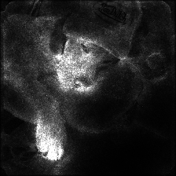
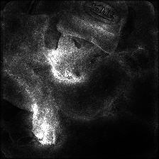
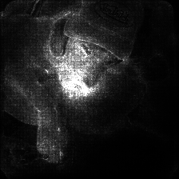
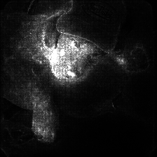
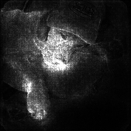
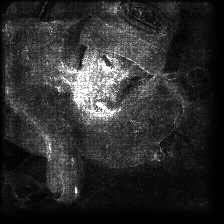
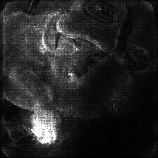

# Model Examples

The model is the "brain" being interrogated — a pretrained ImageNet classifier whose internal decision-making we're visualizing. Different architectures have different visual personalities.

> method: Guided IG · composition: pure_white · colormap: magma · intensity: 0.75 · contrast: 1.5 · threshold: 0.25 · class_index: -1 · input_size: 224 · use_smoothgrad: true · smoothgrad_samples: 25 · **model: varies**

**TLDR:** Coarse and blunt (VGG) → distributed and semantic (ResNet) → diffuse and layered (DenseNet) → multi-scale (Inception) → sparse and shortcut-prone (MobileNet)

| Model | Architecture | Attention character |
|-------|-------------|-------------------|
| **vgg16 / vgg19** | Deep sequential, 3×3 filters, fully-connected head | Large, blocky, coarse — surveillance-like |
| **resnet50 / resnet101** | Residual (skip) connections | Distributed, semantically coherent, more "honest" |
| **densenet121** | Every layer connects to every subsequent layer | Diffuse, multi-scale, almost painterly |
| **inception_v3** | Parallel convolutions at 1×1, 3×3, 5×5 simultaneously | Multi-scale, can look fractal. Requires input_size 299. |
| **mobilenet_v3_large** | Depthwise separable convolutions, mobile-optimized | Sparsest — fixates on the single cheapest distinguishing feature |

---

### VGG16 and VGG19

Among the oldest and simplest networks still in use (2014). Deliberately minimal: stack many small 3×3 convolutional filters in sequence, going deeper and deeper, with max-pooling layers periodically halving spatial resolution. VGG16 has 16 layers with learned weights; VGG19 has 19. Both end with three large fully-connected layers that make the final classification decision.

Each convolutional layer detects increasingly abstract features — early layers find edges and color gradients, middle layers find textures and simple shapes, later layers find object parts. Because the architecture is purely sequential with no shortcuts, the network has to "look hard" at large regions to make decisions rather than pinpointing specific features. The result is the **largest, most spatially coarse attention patterns** of any model here — blunt, blocky, and aggressive. Good for a surveillance aesthetic.

**vgg16** 

**vgg19** 

---

### ResNet50 and ResNet101

ResNets (2015) introduced the **residual connection**: instead of forcing every layer to learn a full transformation, each block learns only the *residual* — the difference between its input and desired output — and adds the original input back to the result. This allows gradients to flow much more cleanly through the network during training.

Because residual connections preserve information across layers more faithfully, saliency maps tend to reflect what the model actually uses to make its decision. Attention is **more distributed and semantically coherent** than VGG — multiple relevant regions rather than one dominant blob. Less visually aggressive, more structurally legible.

**resnet50** 

**resnet101** 

---

### DenseNet121

Where ResNet connects each block only to the next, DenseNet (2016) connects **every layer directly to every subsequent layer** in its dense block. The 121 refers to the total number of layers.

Because every layer receives feature maps from all previous layers, the network never discards information — early features like edges and color gradients remain directly accessible all the way through. Each layer has a "collective memory" of everything seen at every level of abstraction. This produces the **most distributed, multi-scale attention patterns**: low-level and high-level features highlighted simultaneously, overlapping at different scales. The result is diffuse and layered, almost painterly.

**densenet121** 

---

### InceptionV3

Inception (2015) introduced **parallel convolutions at multiple scales within a single layer**. Each inception module simultaneously applies 1×1, 3×3, and 5×5 convolutions plus max-pooling, then concatenates all outputs — the network learns which scale is useful for which features rather than committing to one. V3 adds factorized convolutions and batch normalization throughout.

Because features are detected at multiple scales simultaneously at every level, Inception can respond to both fine-grained texture and large structural shapes together. Attention maps can look **almost fractal** — broad regions of moderate attention with sharp peaks at specific features within them.

> Requires `input_size: 299` — it was trained at that resolution, giving slightly more spatial detail in output maps.

**inception_v3** 

---

### MobileNetV3 Large

Explicitly designed for smartphones and embedded devices (2019). Uses **depthwise separable convolutions** — splitting a standard convolution into a depthwise step (filters each channel independently) and a pointwise step (combines channels) — reducing computational cost by roughly 8–9×.

The aggressive compression forces the network to extract the most discriminative features with minimal computation, pruning everything that doesn't directly help classification. The result is the **sparsest, most minimal attention maps**: often fixating on a single small region because that's the cheapest path to a confident prediction. Conceptually interesting as commentary on algorithmic shortcuts — it's not trying to understand the image, just find the easiest distinguishing feature. The attention can feel almost arbitrary.

**mobilenet_v3_large** 

---

### What's Absent and Why

Transformer-based vision models (ViT, CLIP) were excluded because they use explicit attention heads rather than convolutions — their attention is already readable through other means, which would change the conceptual framing. This project is specifically about making the *implicit* computational gaze of convolutional networks visible, which is a different claim than reading the explicit attention weights of a transformer.