# Algorithmic Attention (XAI) Tool Documentation

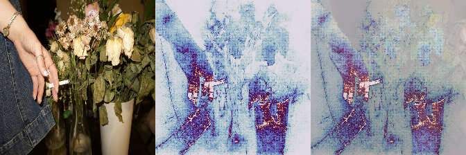

My tool uses pretrained image classifiers using gradient-based saliency methods from Google's [PAIR saliency library](https://github.com/PAIR-code/saliency), exposing the hidden attentional logic of neural networks as visual artifacts. Built as a custom ComfyUI node set.

The core question it answers: *when a model classifies an image, which pixels drove that decision?*
(and, how can we make art with *algorithmic attention*.

---

## Table of Contents

1. [How It Works](#how-it-works)
2. [Models](#models)
3. [Methods](#methods)
4. [Composition Modes](#composition-modes)
5. [Colormaps](#colormaps)
6. [Other Parameters](#other-parameters)

---

## How It Works

All eight supported models are **convolutional neural networks (CNNs)** trained on ImageNet, which is a dataset of 1.2 million images across 1,000 categories. The training process adjusts millions of numerical weights until the network can reliably distinguish between categories like "labrador retriever," "coffee," and "duck."

What makes them useful for saliency visualization is that they're all **differentiable**, built from mathematical operations (matrix multiplications, convolutions, activation functions), so you can calculate the derivative of the classification output with respect to any input pixel. That derivative is the gradient: *if I changed this pixel slightly, how much would the model's confidence change?* High gradient = the model is paying attention to that pixel.

The models differ in architecture, which changes the *character* of their attention; where they look, how diffuse or concentrated it is, how coarse or fine-grained...

---

## Models

The model is the "brain" of the node. 

> **Demo settings:** method: Guided IG · composition: pure_white · colormap: magma · intensity: 0.75 · contrast: 1.5 · threshold: 0.25 · class_index: -1 · input_size: 224 · use_smoothgrad: true · smoothgrad_samples: 25

**TLDR:** Coarse and blunt (VGG) → distributed and semantic (ResNet) → diffuse and layered (DenseNet) → multi-scale (Inception) → sparse and shortcut-prone (MobileNet/EfficientNet)

---

### VGG16 and VGG19

Among the oldest and simplest networks still in common use, the design is a deliberately minimal stack of small 3×3 convolutional filters in sequence, going deeper and deeper, with max-pooling layers periodically halving the spatial resolution. VGG16 has 16 layers with learned weights; VGG19 has 19. Both end with three large fully-connected layers that make the final classification decision.

Each convolutional layer detects increasingly abstract features. The early layers find edges and color gradients, middle layers find textures and simple shapes, and later layers find object parts. The fully-connected layers at the end combine everything into a single classification verdict. Because the architecture is purely sequential with no shortcuts, everything must compress through a bottleneck.

VGG models have the largest, most spatially coarse attention patterns of any model here. Because the architecture is old and inefficient, it has to "look hard" at large regions rather than pinpointing specific features. The saliency maps feel somewhat unpredictable and often grab large swaths of the face, background, or contextual objects. This reads more like surveillance than recognition. VGG16 and VGG19 produce slightly different patterns because the extra three layers in VGG19 allow slightly more abstraction, but both share this coarseness.

**VGG16**

**VGG19**

---

### ResNet50 and ResNet101

ResNets introduced the **residual connection**. So, each block of layers learns only the *residual* — the difference between its input and desired output. The input is added back to the output before passing to the next block. This allows networks to be made much deeper(without the vanishing gradient problem!).

The residual connections builds up information can skip over groups of layers and travel directly toward the output, meaning the network doesn't have to compress everything through every layer. ResNet50 has 50 layers organized into four stages of residual blocks; ResNet101 doubles the middle stages.

ResNets produce more distributed, semantically coherent attention than VGG. The saliency maps tend to reflect what the model uses to make its decision more faithfully.

**ResNet50**

**ResNet101**

---

### DenseNet121

DenseNet takes the residual connection idea from ResNet and pushes it further. While ResNet connects each block only to the next, in DenseNet every layer connects directly to every subsequent layer in a dense block. 
(The 121 refers to the total number of layers.)

Because every layer receives feature maps from all previous layers, the network never discards information. Early features, like edges, simple textures, color gradients, remain directly accessible all the way through the network. Each layer has access to a "collective memory" of everything seen at every previous level of abstraction. 

DenseNet produces the most distributed, multi-scale attention patterns. Because every layer draws on both low-level and high-level features simultaneously, these saliency maps highlight many overlapping regions at different scales.

**DenseNet121**

---

### InceptionV3

The Inception model introduced parallel convolutions at multiple scales within a single layer. Each "inception module" simultaneously applies 1×1, 3×3, and 5×5 convolutions plus a max-pooling operation, then concatenates all the outputs. The network learns which scale is useful for which features rather than committing to one.

Because features are detected at multiple scales simultaneously throughout the network, Inception can respond to both fine-grained texture (small filters) and large structural shapes (large filters) at every level. The 1×1 convolutions act as dimensionality reduction to keep computation manageable. V3 adds factorized convolutions (replacing 5×5 with two sequential 3×3 filters for efficiency) and batch normalization throughout. Inception produces multi-scale attention that can look almost fractal.

> **Note:** InceptionV3 requires `input_size: 299` instead of 224, because it was trained at that resolution. This produces slightly more spatial detail in the output.

**InceptionV3**

---

### MobileNetV3 Large

MobileNet was made to run on smartphones and embedded devices with limited compute. It uses depthwise separable convolutions, meaning it splits a standard convolution into two steps (a depthwise step that filters each channel separately, then a pointwise step that combines channels) reducing computational cost. V3 added neural architecture search (NAS) and squeeze-and-excitation blocks that explicitly learn which feature channels matter most.

The aggressive computational compression means MobileNet achieves classification using far fewer operations than any other model here. The network is forced to extract the most discriminative features with minimal computation, pruning everything that doesn't directly help.

MobileNet produces the sparsest, most minimal attention maps. It often fixates on a single small region, because that's the cheapest path to a confident classification. This makes it conceptually interesting as commentary on algorithmic shortcuts: it's not trying to "understand" the image, just find the easiest distinguishing feature. The attention can feel almost arbitrary, which is itself a statement.

**MobileNetV3**

---

### What's Absent and Why

Transformer-based vision models (ViT, CLIP) were excluded because they use explicit attention heads rather than convolutions, making gradient-based saliency methods less directly applicable. Their attention is already readable through other means. This project is specifically about making the *implicit* computational gaze of convolutional networks visible, which is a different conceptual claim than reading explicit attention weights from a transformer.

---

## Methods

These are the different mathematical techniques used to ask "what pixels mattered to this model's decision?" 

> **Demo settings:** model: vgg16 · composition: pure_white · colormap: magma · intensity: 0.75 · contrast: 1.5 · threshold: 0.25 · class_index: -1 · input_size: 224 · use_smoothgrad: true · smoothgrad_samples: 25

---

### Vanilla Gradients

The simplest approach: take the partial derivative of the classification output with respect to each input pixel. The result is noisy, almost like static or grain, because it shows every pixel that had *any* influence at all. 

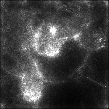

---

### SmoothGrad

Takes Vanilla Gradients but runs it many times with small random noise added to the image each time, then averages the results. The noise cancels out spurious gradients while stable signals reinforce, revealing more structurally reliable patterns. 

The `smoothgrad_samples` parameter controls how many noisy runs are averaged. More = smoother but proportionally slower.

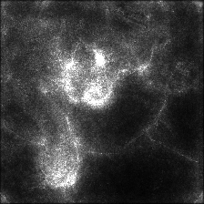

---

### Integrated Gradients

Instead of computing gradients at only the input image, this traces a path from a blank black image to the actual image and accumulates gradients at every step along that path. It satisfies formal mathematical axioms about attribution (completeness, sensitivity, linearity).

The `ig_steps` parameter controls how many interpolation steps are taken. More steps = more accurate attribution, slower computation. 

---

### Blur IG

A variant of Integrated Gradients where instead of interpolating from a black image to the input, it interpolates from a *heavily blurred version* of the image to the sharp version. The difference in what's being integrated changes what gets attributed.

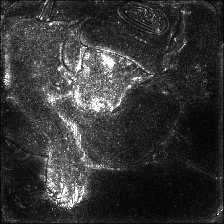

---

### Guided IG

Another IG variant that uses gradient information to choose a smarter integration path, concentrating steps where the gradients are largest rather than taking uniform steps. This produces sharper, higher-contrast attribution maps with more defined edges.

---

### XRAI

A completely different approach. Instead of pixel-level gradient computation, XRAI segments the image into regions using an oversegmentation algorithm, then attributes importance to each region as a whole by measuring how much removing it changes the model's output.

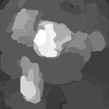

---

## Composition Modes

These control how the saliency map is composited back onto the original image. This is where the artistic and conceptual intent lives.

> **Demo settings:** model: vgg16 · method: Guided IG · colormap: magma · intensity: 0.75 · contrast: 1.5 · threshold: 0.25 · class_index: -1 · input_size: 224 · use_smoothgrad: true · smoothgrad_samples: 25

---

### isolation

Salient regions appear in full color using the chosen colormap; everything else converts to greyscale. 

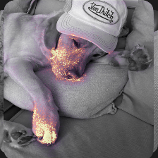

---

### overlay

Classic heatmap blend. The colormap is alpha-composited over the original at the `intensity` level. 

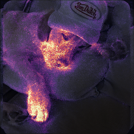

---

### spotlight

Salient regions are bright; everything else darkens.

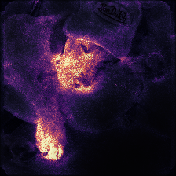

---

### ghost

The original image fades to 25% opacity and the saliency map layers over it. 

---

### invert

Shows what the algorithm *ignores* instead of what it sees. The saliency map is inverted before compositing.

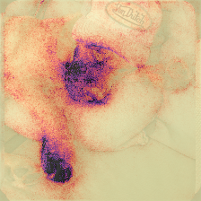

---

### cutout

Hard binary mask. Pixels above the `threshold` value show the original image in full; everything below shows a dim version of the heatmap. 

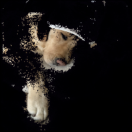

---

### multiply

Photoshop-style multiply blend. 

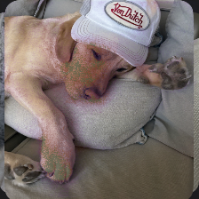

---

### screen

Photoshop-style screen blend. Attention brightens salient regions. 

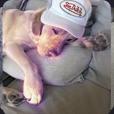

---

### triptych

Outputs three panels side by side: original image | saliency map alone | composite. Shows the full chain of the visualization in one frame. 

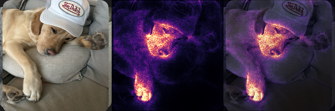

---

### mask_only

Just the colored saliency map with no original image. 

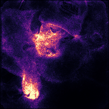

---

### pure_white

Black background, saliency values mapped directly to white intensity. 

---

## Colormaps

These apply a color gradient to the greyscale saliency values. Low values (less attended) map to one end of the gradient; high values (more attended) map to the other.

> **Demo settings:** model: vgg16 · method: Guided IG · composition: invert · intensity: 0.75 · contrast: 1.5 · threshold: 0.25 · class_index: -1 · input_size: 224 · use_smoothgrad: true · smoothgrad_samples: 25

---

| Colormap | Range | Character |
|----------|-------|-----------|
| **inferno** | Black → purple → orange → yellow | High contrast, dramatic. The default — feels urgent, slightly threatening |
| **plasma** | Purple → pink → yellow | Vibrant and synthetic-looking, digital, almost neon |
| **magma** | Black → deep purple → pink-white | Darker and moodier than inferno, more melancholic |
| **viridis** | Purple → teal → yellow-green | Standard scientific colormap, perceptually uniform, readable but less dramatic |
| **hot** | Black → red → orange → white | Classic heat vision / thermal camera aesthetic |
| **cool** | Cyan → magenta | Cold, clinical, almost medical |
| **spring** | Magenta → yellow | Neon, synthetic, maximally artificial |
| **copper** | Black → brown → copper-gold | Metallic, archival, almost daguerreotype-like |
| **twilight** | Purple → white → orange → purple (cyclical) | Smooth and atmospheric |
| **ocean** | Black-blue → cyan → white | Deep and watery |

---

**cool**

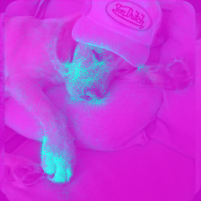

**hot**

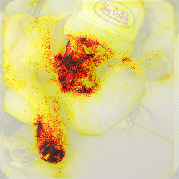

**copper**

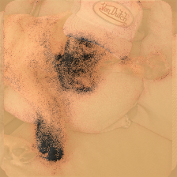

**inferno**

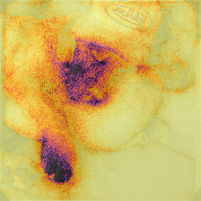

**magma**

**ocean**

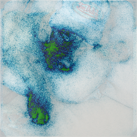

**plasma**

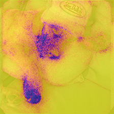

**spring**

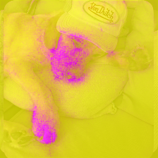

**twilight**

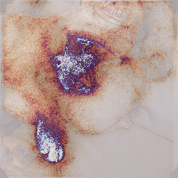

**viridis**

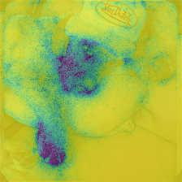

---

## Other Parameters

> **Demo settings:** model: vgg16 · method: Guided IG · composition: invert · colormap: magma · class_index: -1 · input_size: 224

### Intensity

Controls how strongly the saliency visualization blends onto the original. 0 = invisible, 1 = full replacement. Most compositions look best between 0.6–0.85.

Default: **0.75** — chosen as the midpoint that preserves enough of the original image for readability while letting the saliency map dominate visually.

**intensity = 0.5** (lower)

**intensity = 1.0** (higher / full)

---

### Contrast (Gamma)

Applies a power function to the saliency values before visualization: `value^(1/contrast)`. Values above 1.0 compress the low end and expand the high end.

Default: **1.5**.

**contrast = 1.0** (flat, no adjustment)

**contrast = 2.0** (more aggressive)

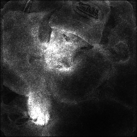

---

### Threshold

Sets the minimum saliency value to be considered "attended to," used primarily by `isolation` and `cutout` modes. Higher values make the visualization sparser. At 0.0, everything is included; at 0.5, only the top half of saliency values show.

Default: **0.25** — chosen to eliminate low-confidence gradient noise while preserving the meaningful attended region.

**threshold = 0.0** (nothing filtered)

**threshold = 0.5** (aggressive filtering)

---

### Class Index

ImageNet has 1,000 classes. By default (`-1`), the node auto-detects the model's top prediction and visualizes attention for that class.

You can override this to force visualization of a different class. It makes visible the categorical violence of being misclassified, or the absurdity of applying animal classification to a human subject.

The classification label output of the node always shows what class is actually being visualized.

**class_index = 1** (a modest override)

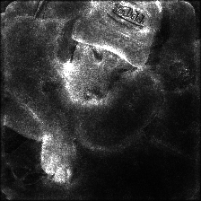

**class_index = 10** (a larger displacement)

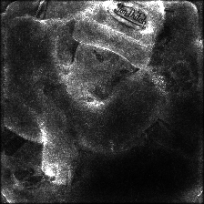

---

### Input Size

All these models were trained on fixed-size square inputs. 224×224 is standard for most models; InceptionV3 requires 299×299 because it was trained at that resolution. The image is resized to this before processing, so the output appears at that resolution. Changing this for non-Inception models produces undefined behavior and is not recommended.

Default: **224** — not adjusted in demos because most models require it.

---

### Use SmoothGrad

When enabled on top of any method (except SmoothGrad itself), applies the SmoothGrad noise-averaging process to smooth the result. Generally produces more aesthetically pleasing, less noisy outputs at the cost of being proportionally slower (it runs the full forward/backward pass `smoothgrad_samples` times).

Default: **true** — the aesthetic improvement is significant and the default sample count of 25 is fast enough for most use.

**use_smoothgrad = false**

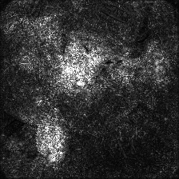

---

### Smoothgrad Samples

How many noisy samples to average when SmoothGrad is active. 25 is a good balance between smoothness and speed. 50+ produces noticeably smoother results but takes proportionally longer. On CPU with VGG16, 50 samples takes roughly twice as long as 25.

Default: **25**

**samples = 50**

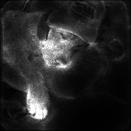

---

*Tool built with [PAIR Saliency](https://github.com/PAIR-code/saliency), [PyTorch](https://pytorch.org/), and [ComfyUI](https://github.com/comfyanonymous/ComfyUI).*

---

Some artwork I've made with the tool so far:

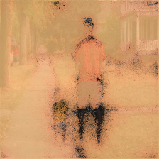
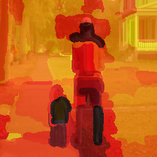
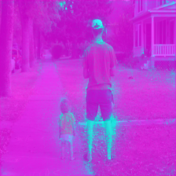
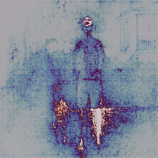
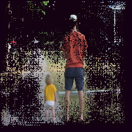
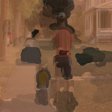